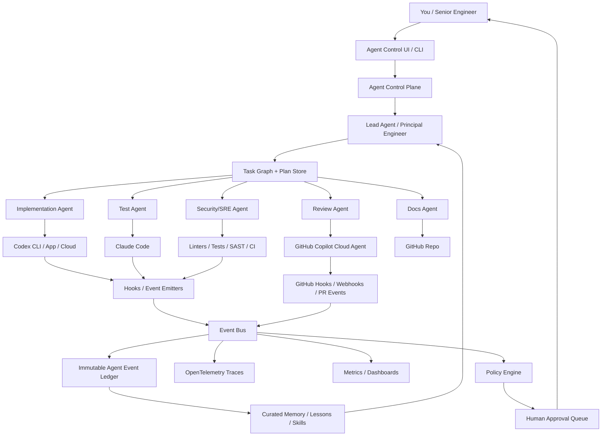
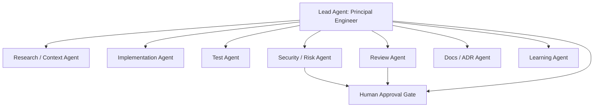
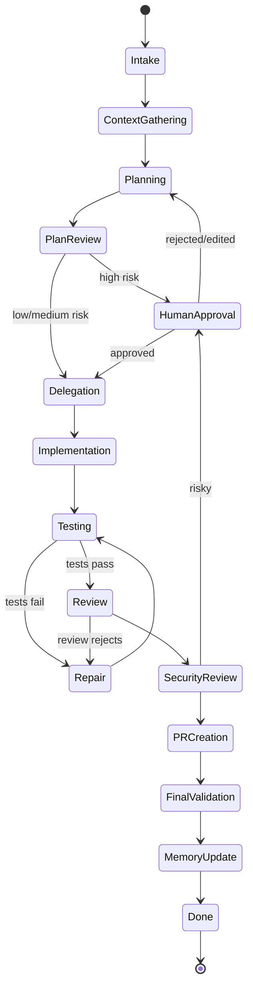
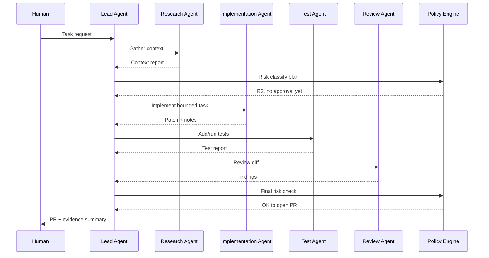
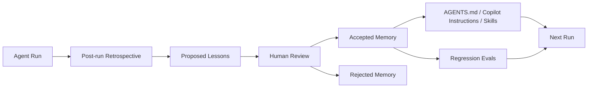

You can make this possible, but the system should **not** start as “many AI agents talking freely.” Start as a **governed engineering control plane** where agents are observable workers with contracts, permissions, traces, artifacts, and review gates.

The key idea:

> **Your system owns orchestration, state, policy, monitoring, memory, and approvals. Copilot, Codex, and Claude Code are execution backends.**

That is the difference between a fun demo and something a senior engineer can trust during real development.

---

# 1. Target architecture



The **lead agent** should not directly “trust” worker agents. It should behave like a principal engineer: decompose work, assign bounded tasks, require evidence, inspect diffs, and escalate risky actions to you.

Current tools already give you useful integration points. GitHub Copilot cloud agent can work autonomously in a GitHub Actions-powered environment, create branches, make code changes, and optionally open PRs; GitHub’s docs also note that steps are visible in commits/logs and that PR lifecycle metrics can be tracked. ([GitHub Docs][1]) Copilot tasks can be assigned through the API with optional fields such as custom instructions, custom agent, base branch, repository, and model. ([GitHub Docs][2]) Copilot custom agents are Markdown-based profiles with prompts, tools, and MCP servers. ([GitHub Docs][3]) Codex cloud can run tasks in the background and in parallel in its own cloud environment. ([OpenAI Developers][4]) Codex also supports hooks, `AGENTS.md`, skills, and subagents, which are directly useful for your “trackable agent organization” idea. ([OpenAI Developers][5]) Claude Code has lifecycle hooks and MCP integration, which makes it especially useful for local observability and policy enforcement. ([Claude][6])

---

# 2. Define “trackable agent” precisely

A trackable agent is not just a prompt. It is a **runtime actor with an observable contract**.

Each agent should have:

| Dimension      | What you define                                                         |
| -------------- | ----------------------------------------------------------------------- |
| Identity       | `agent_id`, role, version, owner, model/tool backend                    |
| Responsibility | What this agent is allowed to decide                                    |
| Inputs         | Task spec, repo context, constraints, dependencies                      |
| Outputs        | Plan, patch, test report, review, ADR, PR, decision record              |
| Tools          | Git, shell, GitHub, issue tracker, docs, test runners, MCP tools        |
| Permissions    | Read-only, branch write, test execution, PR creation, no-prod, etc.     |
| Memory         | Which previous lessons/rules it may read                                |
| Telemetry      | Every prompt, decision summary, tool call, file change, command, result |
| Evaluation     | How success/failure is measured                                         |
| Escalation     | When it must ask you                                                    |

Important: you cannot reliably monitor a model’s hidden internal reasoning. You should monitor **observable behavior**: plans, decisions, tool calls, diffs, test results, review comments, approval requests, and post-run retrospectives. Require agents to produce a **decision record**, not raw hidden reasoning.

A good decision record looks like this:

```json
{
  "decision_id": "dec_2026_04_21_001",
  "run_id": "run_auth_audit_123",
  "agent_id": "lead.principal-engineer.v1",
  "question": "Should we implement audit logging in middleware or service layer?",
  "options_considered": [
    "middleware",
    "service layer",
    "event bus subscriber"
  ],
  "chosen_option": "service layer",
  "rationale_summary": "Service layer has access to domain user and tenant context; middleware does not.",
  "evidence": [
    "src/auth/session_service.ts",
    "tests/auth/session_service.test.ts"
  ],
  "risk_level": "R2",
  "requires_human_approval": false,
  "timestamp": "2026-04-21T10:15:00+02:00"
}
```

---

# 3. Agentic organization

Use a small organization first. Do **not** start with 20 agents.



Recommended initial roles:

| Agent                     | Role                                                    | Good backend                                 |
| ------------------------- | ------------------------------------------------------- | -------------------------------------------- |
| Lead / Principal Engineer | Breaks work into plan, assigns tasks, verifies evidence | Your own orchestrator + LLM                  |
| Research Agent            | Reads repo, issues, docs, prior PRs                     | Claude Code or Codex                         |
| Implementation Agent      | Writes bounded code changes                             | Codex / Claude Code / Copilot                |
| Test Agent                | Adds tests, runs local checks, interprets failures      | Claude Code or Codex                         |
| Review Agent              | Reviews diff against standards                          | Copilot review, Claude Code, Codex `/review` |
| Security/SRE Agent        | Checks secrets, auth, migrations, infra risk            | Claude Code + local scanners                 |
| Docs/ADR Agent            | Updates docs, creates decision records                  | Any                                          |
| Learning Agent            | Extracts lessons after run, proposes memory updates     | Your own service, human-reviewed             |

Codex subagents can be useful for parallel review or specialist tasks, but Codex docs state that Codex only spawns a new agent when you explicitly ask it to do so, and then consolidates results after the requested agents finish. ([OpenAI Developers][7]) That is good: you want explicit delegation, not uncontrolled spawning.

---

# 4. Core control plane components

Build these as independent modules.

| Component         | Responsibility                                                |
| ----------------- | ------------------------------------------------------------- |
| Task Intake       | Converts your request into a structured task                  |
| Agent Registry    | Knows available agents, versions, prompts, tools, permissions |
| Orchestrator      | Runs the task graph/state machine                             |
| Policy Engine     | Decides what is allowed, blocked, or approval-required        |
| Tool Gateway      | Wraps shell, GitHub, DB, filesystem, MCP tools                |
| Event Ledger      | Immutable append-only behavior log                            |
| Trace System      | OpenTelemetry spans/traces for each run                       |
| Artifact Store    | Plans, diffs, logs, screenshots, test reports, PR links       |
| Approval Queue    | Human-in-the-loop decisions                                   |
| Evaluation Engine | Checks correctness, quality, risk, regressions                |
| Memory Service    | Stores curated lessons, not random chat history               |
| Dashboard         | Shows agent behavior, status, quality, risk, cost             |

For tracing, use OpenTelemetry as the common layer. OpenTelemetry has GenAI semantic conventions for agent and framework spans, currently marked as development, so use them but keep your own stable internal event schema too. ([OpenTelemetry][8])

---

# 5. The event ledger is the heart of the system

Every agent action should become an event.

Minimum event types:

| Event                | Example                                      |
| -------------------- | -------------------------------------------- |
| `session.started`    | Development session begins                   |
| `task.created`       | User asked for feature/bug/refactor          |
| `plan.proposed`      | Lead creates plan                            |
| `task.delegated`     | Lead assigns subtask to worker               |
| `prompt.submitted`   | Prompt sent to Codex/Claude/Copilot          |
| `tool.pre_call`      | Agent wants to run command                   |
| `tool.post_call`     | Command finished                             |
| `file.changed`       | Diff or file hash changed                    |
| `test.started`       | Test command began                           |
| `test.finished`      | Pass/fail plus report                        |
| `risk.detected`      | Migration, auth, secret, destructive command |
| `approval.requested` | Needs human decision                         |
| `approval.resolved`  | Approved, edited, rejected                   |
| `pr.created`         | PR opened                                    |
| `review.completed`   | Review result                                |
| `memory.proposed`    | Agent suggests new project rule              |
| `memory.approved`    | Human accepted rule                          |
| `run.completed`      | Final status                                 |

Example canonical event:

```json
{
  "event_id": "evt_01HV...",
  "trace_id": "trace_abc",
  "run_id": "run_123",
  "task_id": "task_456",
  "parent_task_id": "task_001",
  "agent_id": "impl.codex.v1",
  "agent_role": "implementation",
  "backend": "codex-cli",
  "event_type": "tool.pre_call",
  "timestamp": "2026-04-21T10:22:31+02:00",
  "risk_level": "R2",
  "tool": {
    "name": "bash",
    "args_redacted": {
      "command": "npm test -- auth"
    }
  },
  "repo": {
    "owner": "your-org",
    "name": "your-repo",
    "branch": "agent/run_123/auth-audit",
    "commit": "abc123"
  },
  "decision": {
    "requires_approval": false,
    "policy_rule": "tests_allowed"
  },
  "result": null
}
```

Store this in Postgres or ClickHouse. Send traces to OpenTelemetry Collector, then to Grafana Tempo/Jaeger. Send logs to Loki/ELK. Store artifacts in S3-compatible storage or GitHub artifacts.

---

# 6. Monitoring model

You need three monitoring layers.

## Layer A: Engineering progress

| Metric                     | Why it matters                             |
| -------------------------- | ------------------------------------------ |
| Active runs                | What agents are doing now                  |
| Current task state         | Planning, coding, testing, review, blocked |
| PRs created                | Output volume                              |
| Time to first plan         | Planning latency                           |
| Time to first passing test | Execution quality                          |
| Time to PR                 | Delivery speed                             |
| Human approvals pending    | Bottlenecks                                |

## Layer B: Behavioral safety

| Metric                         | Why it matters             |
| ------------------------------ | -------------------------- |
| Risky command attempts         | Detect dangerous autonomy  |
| Denied tool calls              | Shows policy pressure      |
| Secret access attempts         | Critical security signal   |
| Protected file changes         | Prevents accidental damage |
| Production-touching actions    | Should be very rare        |
| Dependency changes             | Supply-chain risk          |
| Auth/payment/migration touches | High-risk code paths       |

## Layer C: Quality and learning

| Metric                       | Why it matters             |
| ---------------------------- | -------------------------- |
| Test pass rate per agent     | Which agents are reliable  |
| Review rejection rate        | Which agents create rework |
| Repeated failure loops       | Agent stuckness            |
| Flaky test loops             | Bad autonomy signal        |
| Lines changed per task       | Scope creep                |
| Files touched outside scope  | Boundary violation         |
| Human edits after agent PR   | Quality proxy              |
| Regression count             | Long-term trust metric     |
| Lessons proposed vs accepted | Learning quality           |

A useful dashboard row:

| Run       | Lead decision | Workers | State   | Risk | Latest action         | Tests        | PR   | Human needed |
| --------- | ------------: | ------: | ------- | ---- | --------------------- | ------------ | ---- | ------------ |
| `run_123` |             4 |       3 | Review  | R2   | Claude reviewing diff | 132/132 pass | #981 | No           |
| `run_124` |             2 |       1 | Blocked | R4   | Tried DB migration    | Not run      | None | Yes          |

---

# 7. Human-in-the-loop versus autonomous modes

Do not make this binary. Use a risk matrix.

| Risk              | Agent may do autonomously                                      | Human required                       |
| ----------------- | -------------------------------------------------------------- | ------------------------------------ |
| R0 Read-only      | Read files, summarize, plan, inspect issues                    | No                                   |
| R1 Safe local     | Run tests, lint, typecheck, format, edit docs                  | Usually no                           |
| R2 Bounded code   | Modify app code on isolated branch, add tests, open PR         | No merge without review              |
| R3 Sensitive code | Auth, billing, permissions, data model, dependency upgrades    | Approval before implementation or PR |
| R4 Dangerous      | Prod deploy, secret access, destructive DB ops, infra deletion | Explicit approval, often blocked     |
| R5 Forbidden      | Exfiltration, bypassing controls, disabling security           | Always block                         |

MCP needs special care. The MCP specification describes tools as functions that models can execute and explicitly highlights consent/control, data privacy, and tool-safety concerns. ([Model Context Protocol][9]) GitHub’s Copilot cloud-agent MCP docs warn that, once an MCP server is configured, Copilot may use the server’s tools autonomously without asking for approval; they also note cloud agent currently supports MCP tools, not resources or prompts. ([GitHub Docs][10]) Therefore, your MCP layer should be a **policy-enforcing gateway**, not a direct connection to everything.

---

# 8. Complex task execution state machine

Use an explicit state machine, not free-form chats.



Each transition emits an event. Each state has clear entry and exit criteria.

Example exit criteria for `Testing`:

```yaml
testing_exit_criteria:
  required:
    - lint_passed
    - typecheck_passed
    - relevant_unit_tests_passed
    - changed_files_within_scope
  optional:
    - coverage_not_decreased
    - integration_tests_passed
  fail_if:
    - new_snapshot_without_explanation
    - skipped_test_added
    - test_command_not_recorded
```

---

# 9. Tool-specific integration strategy

## GitHub Copilot

Use Copilot for GitHub-native tasks: issues, PRs, branches, code review, and background work.

Good uses:

| Use                             | Pattern                                              |
| ------------------------------- | ---------------------------------------------------- |
| Background issue implementation | Control plane creates/updates issue, assigns Copilot |
| PR generation                   | Copilot creates branch/PR                            |
| Repo instructions               | `.github/copilot-instructions.md`                    |
| Specialized agents              | `.github/agents/*.agent.md`                          |
| Agent hooks                     | `.github/hooks/*.json`                               |
| PR/session tracking             | GitHub webhooks + Copilot logs/metrics               |

GitHub supports repository-wide custom instructions in `.github/copilot-instructions.md` and path-specific instructions in `.github/instructions/*.instructions.md`. ([GitHub Docs][11]) Copilot hooks can be placed under `.github/hooks/`, with events such as `sessionStart`, `sessionEnd`, `userPromptSubmitted`, `preToolUse`, `postToolUse`, and `errorOccurred`. ([GitHub Docs][12])

## Codex

Use Codex for local coding loops, explicit subagents, repeatable skills, and heavy implementation sessions.

Good uses:

| Use                       | Pattern                             |
| ------------------------- | ----------------------------------- |
| Personal coding standards | `~/.codex/AGENTS.md`                |
| Repo standards            | repo `AGENTS.md`                    |
| Workflow packages         | `.agents/skills/*/SKILL.md`         |
| Lifecycle monitoring      | `.codex/hooks.json`                 |
| Parallel analysis         | explicit Codex subagents            |
| MCP tools                 | project-scoped `.codex/config.toml` |

Codex hooks can run deterministic scripts during the agent loop, including prompt logging, secret scanning, validation, and stop-time checks; they are behind a feature flag and currently experimental. ([OpenAI Developers][5]) Codex’s hook docs also note current limitations around shell interception, so do not treat hooks as your only security boundary. ([OpenAI Developers][5])

## Claude Code

Use Claude Code where hooks, local repo exploration, subagent events, and MCP-connected tools are valuable.

Good uses:

| Use                    | Pattern                                                         |
| ---------------------- | --------------------------------------------------------------- |
| Local behavior logging | `UserPromptSubmit`, `PreToolUse`, `PostToolUse`, `Stop` hooks   |
| Safety checks          | `PreToolUse` hook blocks destructive commands                   |
| Subagent tracking      | `SubagentStart`, `SubagentStop`, `TaskCreated`, `TaskCompleted` |
| Context injection      | `SessionStart`                                                  |
| External systems       | MCP                                                             |

Claude Code’s hook reference lists many useful lifecycle events, including session start/end, prompt submission, pre/post tool use, subagent start/stop, task created/completed, file changes, worktree events, compaction events, and MCP elicitation events. ([Claude][6])

---

# 10. Repository structure I would create

```text
repo/
  .ai/
    org/
      roles/
        lead-principal-engineer.md
        implementation-agent.md
        test-agent.md
        review-agent.md
        security-agent.md
        docs-agent.md
      workflows/
        feature-development.yaml
        bugfix.yaml
        refactor.yaml
        dependency-upgrade.yaml
      policies/
        autonomy-policy.yaml
        protected-files.yaml
        command-policy.yaml
        approval-policy.yaml
      evals/
        coding-quality.yaml
        test-quality.yaml
        security-review.yaml
      memory/
        accepted-lessons.md
        rejected-lessons.md
      adr/
        template.md

  .github/
    copilot-instructions.md
    instructions/
      frontend.instructions.md
      backend.instructions.md
      tests.instructions.md
    agents/
      planner.agent.md
      reviewer.agent.md
      testing.agent.md
    hooks/
      agent-observability.json

  .codex/
    config.toml
    hooks.json
    hooks/
      log_event.py
      policy_check.py
      summarize_run.py

  .claude/
    settings.json
    hooks/
      log_event.sh
      block_dangerous_commands.py
      post_tool_report.py

  .agents/
    skills/
      create-adr/
        SKILL.md
      review-pr/
        SKILL.md
      add-tests/
        SKILL.md

  AGENTS.md
  CLAUDE.md
```

Purpose of the main files:

| File                              | Purpose                               |
| --------------------------------- | ------------------------------------- |
| `.github/copilot-instructions.md` | Copilot repo-wide behavior            |
| `.github/agents/*.agent.md`       | Specialized Copilot agents            |
| `.github/hooks/*.json`            | Copilot cloud/CLI observability hooks |
| `AGENTS.md`                       | Codex repo-level instructions         |
| `.codex/hooks.json`               | Codex local lifecycle hooks           |
| `.claude/settings.json`           | Claude Code hooks                     |
| `.agents/skills/*/SKILL.md`       | Reusable agent workflows              |
| `.ai/policies/*.yaml`             | Your source of truth for autonomy     |
| `.ai/memory/accepted-lessons.md`  | Human-approved learning               |

---

# 11. Policy-first design

Create a policy file before creating many agents.

```yaml
version: 1

risk_levels:
  R0:
    description: "Read-only analysis"
    approval: "never"
    allowed_tools:
      - read_file
      - grep
      - list_issues
      - summarize

  R1:
    description: "Safe local changes"
    approval: "auto"
    allowed_tools:
      - edit_docs
      - run_tests
      - run_lint
      - format_code

  R2:
    description: "Bounded code changes on branch"
    approval: "auto_until_pr"
    constraints:
      - "must_use_agent_branch"
      - "must_create_tests"
      - "must_open_pr_not_merge"

  R3:
    description: "Sensitive application behavior"
    approval: "before_implementation"
    triggers:
      - "auth"
      - "authorization"
      - "billing"
      - "payments"
      - "personal_data"
      - "schema_migration"
      - "dependency_upgrade"

  R4:
    description: "Dangerous operational action"
    approval: "explicit_human"
    triggers:
      - "production"
      - "secrets"
      - "cloud_iam"
      - "database_write"
      - "kubectl"
      - "terraform_apply"

  R5:
    description: "Forbidden"
    approval: "block"
    triggers:
      - "disable_security"
      - "exfiltrate_secret"
      - "delete_backups"
      - "bypass_tests"

protected_files:
  - ".env"
  - ".env.*"
  - "secrets/**"
  - ".github/workflows/deploy*.yml"
  - "infra/prod/**"

blocked_commands:
  - "rm -rf /"
  - "git push --force"
  - "kubectl delete"
  - "terraform apply"
  - "gh secret"
  - "aws iam"
```

Your hooks and tool gateway should enforce this. The agents should also read it, but enforcement must be deterministic.

---

# 12. Human-in-the-loop implementation

You need an approval object, not informal chat.

```json
{
  "approval_id": "appr_123",
  "run_id": "run_123",
  "task_id": "task_456",
  "requested_by_agent": "security.sre.v1",
  "risk_level": "R3",
  "action": "modify database migration",
  "summary": "Agent wants to add nullable column user_login_audit.ip_address",
  "evidence": [
    "db/migrations/202604211020_add_login_audit.sql",
    "src/auth/audit.ts"
  ],
  "options": [
    "approve",
    "approve_with_changes",
    "reject",
    "request_more_info"
  ],
  "status": "pending"
}
```

For stateful human-in-the-loop workflows, LangGraph is a good candidate because its persistence/checkpointing supports pausing, resuming, and inspecting state; its human-in-the-loop middleware can interrupt tool calls and resume after approve/edit/reject decisions. ([LangChain Docs][13]) If you are in a Microsoft-heavy ecosystem, Microsoft Agent Framework is also relevant because it combines AutoGen-style multi-agent abstractions with state management, middleware, telemetry, and graph-based workflows. ([Microsoft Learn][14])

My recommendation: **start with your own simple state machine + event ledger**, then adopt LangGraph or Microsoft Agent Framework only when you need durable graph execution at scale.

---

# 13. Multi-agent collaboration pattern

Do not let agents talk endlessly. Use structured collaboration.

## Pattern: Lead-managed fan-out/fan-in



Worker agents should receive small task contracts:

```yaml
task_id: T-003
assigned_agent: implementation.codex.v1
goal: "Add audit event emission after successful login"
allowed_files:
  - "src/auth/**"
  - "tests/auth/**"
forbidden_files:
  - "infra/**"
  - ".github/workflows/**"
required_outputs:
  - "patch"
  - "test_command"
  - "test_result"
  - "decision_record"
constraints:
  - "do not change public API"
  - "do not add dependencies"
  - "do not modify DB schema"
```

---

# 14. Continuous learning and adaptability

Do not let agents directly rewrite their own permanent instructions. That becomes self-corruption.

Use four memory types:

| Memory type       | Stored where            |     Human review? | Example                                          |
| ----------------- | ----------------------- | ----------------: | ------------------------------------------------ |
| Episodic memory   | Immutable run summaries |   No, append-only | “Run 123 failed because test env missing Redis”  |
| Semantic memory   | Repo facts              | Yes for promotion | “Auth service owns login events”                 |
| Procedural memory | Instructions/skills     |               Yes | “Always run `pnpm test:auth` after auth changes” |
| Evaluation memory | Regression/eval cases   |               Yes | “Bug #981 becomes eval case”                     |

Learning loop:



Codex `AGENTS.md` is good for durable instructions, and Codex skills are good for reusable workflows with instructions, scripts, references, and assets. ([OpenAI Developers][15]) For Copilot, use `.github/copilot-instructions.md`, path-specific `.instructions.md`, and custom `.agent.md` profiles. ([GitHub Docs][11]) For Claude Code, use hooks plus project instructions such as `CLAUDE.md`; Claude’s hook reference explicitly notes instruction-loading events for `CLAUDE.md` and `.claude/rules/*.md`. ([Claude][6])

---

# 15. Concrete MVP plan

## MVP 1: Observability before autonomy

Goal: track your current manual sessions with Claude Code/Codex/Copilot.

Build:

1. `agent-control-plane` service with `/events`.
2. Postgres tables: `runs`, `tasks`, `agents`, `events`, `artifacts`, `approvals`.
3. Hook scripts for Claude Code, Codex, and Copilot.
4. GitHub webhook receiver for PR/issue/check events.
5. Basic dashboard.

Minimal event receiver:

```python
# app.py
from fastapi import FastAPI, Request
from pydantic import BaseModel, Field
from datetime import datetime
from typing import Any, Optional
import uuid

app = FastAPI()

class AgentEvent(BaseModel):
    event_id: str = Field(default_factory=lambda: str(uuid.uuid4()))
    timestamp: datetime = Field(default_factory=datetime.utcnow)
    run_id: Optional[str] = None
    task_id: Optional[str] = None
    agent_id: Optional[str] = None
    backend: Optional[str] = None
    event_type: str
    payload: dict[str, Any] = {}

@app.post("/events")
async def ingest_event(event: AgentEvent, request: Request):
    # Replace with Postgres insert + OpenTelemetry span export.
    print(event.model_dump_json())
    return {"ok": True, "event_id": event.event_id}
```

Example generic hook script:

```bash
#!/usr/bin/env bash
set -euo pipefail

payload="$(cat)"

curl -sS \
  -X POST "${AGENT_CONTROL_PLANE_URL}/events" \
  -H "Content-Type: application/json" \
  -d "{
    \"event_type\": \"agent.hook\",
    \"backend\": \"${AGENT_BACKEND:-unknown}\",
    \"agent_id\": \"${AGENT_ID:-unknown}\",
    \"run_id\": \"${AGENT_RUN_ID:-unknown}\",
    \"payload\": $(printf '%s' "$payload" | jq -c .)
  }" >/dev/null
```

## MVP 2: Lead agent plus one worker

Do not start with full collaboration. Start with:

```text
Human → Lead Agent → Implementation Agent → Test Agent → Review Agent → Human
```

The lead produces a `plan.json`:

```json
{
  "goal": "Add login audit event",
  "risk_level": "R2",
  "tasks": [
    {
      "id": "T1",
      "agent": "research",
      "goal": "Find login flow and current audit/logging patterns"
    },
    {
      "id": "T2",
      "agent": "implementation",
      "goal": "Implement audit event emission"
    },
    {
      "id": "T3",
      "agent": "test",
      "goal": "Add or update tests"
    },
    {
      "id": "T4",
      "agent": "review",
      "goal": "Review diff for correctness and risk"
    }
  ],
  "approval_required_before_start": false,
  "approval_required_before_merge": true
}
```

## MVP 3: Policy gates

Add deterministic gates:

| Gate                   | Blocks when                                      |
| ---------------------- | ------------------------------------------------ |
| Protected files        | Agent edits `.env`, prod infra, deploy workflows |
| Dangerous command      | Agent runs destructive shell command             |
| Scope creep            | Files touched outside declared task scope        |
| Test missing           | Code changed without test or explicit waiver     |
| Dependency change      | Package lock changed without approval            |
| Migration/auth/payment | Sensitive area touched                           |
| Secret pattern         | Prompt, diff, or logs include secret-like values |

## MVP 4: GitHub PR loop

Flow:

1. Control plane creates issue.
2. Lead writes plan as issue comment.
3. Worker agent creates branch.
4. CI runs.
5. Review agents comment.
6. Human approves.
7. Merge remains human-controlled until trust is high.

---

# 16. Suggested dashboards

## Dashboard 1: Agent mission control

```text
Current Runs
├── run_123 Add login audit events
│   ├── Lead: waiting for review
│   ├── Impl: completed
│   ├── Test: completed, 132/132 passed
│   ├── Security: no critical findings
│   └── PR: #981
└── run_124 Upgrade auth dependency
    ├── Lead: blocked
    ├── Risk: R3 dependency/auth
    └── Human approval: pending
```

## Dashboard 2: Behavior trace

```text
run_123
  lead.plan                 12s
  research.repo_scan        33s
  impl.codex.edit           4m12s
    tool.bash npm test      pass
    file.changed auth.ts
    file.changed auth.test.ts
  test.claude.review        1m04s
  security.review           42s
  pr.created                #981
```

## Dashboard 3: Reliability by agent

| Agent              | Runs | Success | Avg rework | Blocked actions | Human escalations |
| ------------------ | ---: | ------: | ---------: | --------------: | ----------------: |
| `impl.codex.v1`    |   40 |     82% |        1.4 |               3 |                 7 |
| `review.claude.v1` |   38 |     91% |        0.6 |               0 |                 4 |
| `copilot.pr.v1`    |   21 |     76% |        2.1 |               1 |                 5 |

---

# 17. Practical prompts/contracts

## Lead agent prompt skeleton

```text
You are the Lead Engineering Agent.

Your job:
1. Understand the requested software change.
2. Inspect the repository context.
3. Produce a structured plan.
4. Classify risk using .ai/policies/autonomy-policy.yaml.
5. Delegate bounded subtasks to specialist agents.
6. Require evidence for every claim.
7. Never merge code.
8. Escalate R3+ decisions to the human.

Output:
- plan.json
- task graph
- risk classification
- approval requests if needed
- final evidence summary
```

## Implementation agent prompt skeleton

```text
You are an Implementation Agent.

You receive one bounded task. Do not expand scope.
You may modify only the allowed files.
You must add or update tests when behavior changes.
You must record:
- files changed
- commands run
- test results
- assumptions
- risks
- decision summary

Do not:
- add dependencies
- touch protected files
- alter CI/deploy config
- perform production actions
- merge or push to protected branches
```

## Review agent prompt skeleton

```text
You are a Review Agent.

Review the diff against:
- task goal
- project conventions
- tests
- security policy
- maintainability
- backwards compatibility

Return:
- verdict: approve / request_changes / block
- findings with severity
- evidence by file and line
- missing tests
- risk classification
```

---

# 18. A realistic autonomy policy

For your development sessions, I would allow:

| Scenario                     | Autonomy                             |
| ---------------------------- | ------------------------------------ |
| Generate plan                | Fully autonomous                     |
| Read repo/docs/issues        | Fully autonomous                     |
| Create local branch/worktree | Autonomous                           |
| Modify docs/tests            | Autonomous                           |
| Modify application code      | Autonomous on branch                 |
| Run tests/lint/typecheck     | Autonomous                           |
| Open draft PR                | Autonomous                           |
| Request review               | Autonomous                           |
| Merge PR                     | Human                                |
| Add dependency               | Human                                |
| Modify auth/billing/security | Human                                |
| Create DB migration          | Human before implementation          |
| Touch production infra       | Human, usually blocked               |
| Use secrets                  | Blocked unless special approved flow |
| Deploy                       | Human                                |

This gives you high automation without pretending agents are senior engineers with full production authority.

---

# 19. What I would not do

Avoid these traps:

| Bad idea                               | Better design                                   |
| -------------------------------------- | ----------------------------------------------- |
| Agents directly call each other freely | Lead-managed task graph                         |
| Chat history as memory                 | Curated, versioned memory                       |
| Agent self-updates its rules           | Proposed lessons with human approval            |
| Direct MCP access to sensitive tools   | MCP gateway with policy enforcement             |
| Auto-merge PRs early                   | Human merge until metrics prove safety          |
| Trust “I ran tests”                    | Capture command, exit code, logs, CI artifact   |
| Trust agent self-review                | Separate reviewer + deterministic gates         |
| One giant super-agent                  | Small agents with narrow contracts              |
| No event schema                        | Immutable event ledger                          |
| Monitor only PRs                       | Monitor prompts, tools, diffs, tests, approvals |

---

# 20. Recommended build order

## Step 1 — Standardize repository instructions

Create:

```text
.github/copilot-instructions.md
AGENTS.md
CLAUDE.md
.ai/policies/autonomy-policy.yaml
.ai/workflows/feature-development.yaml
.ai/evals/coding-quality.yaml
```

## Step 2 — Add hooks

Add behavior-logging hooks for:

```text
Claude Code:
  SessionStart
  UserPromptSubmit
  PreToolUse
  PostToolUse
  SubagentStart
  SubagentStop
  Stop
  SessionEnd

Codex:
  SessionStart
  UserPromptSubmit
  PreToolUse
  PermissionRequest
  PostToolUse
  Stop

Copilot:
  sessionStart
  userPromptSubmitted
  preToolUse
  postToolUse
  errorOccurred
  sessionEnd
```

## Step 3 — Build event ingestion

Use FastAPI or Node.js. Store events. Add trace IDs and run IDs.

## Step 4 — Add policy engine

Start simple: YAML rules + Python evaluator. Later you can use OPA/Rego if policies become complex.

## Step 5 — Add `agentctl`

Example CLI:

```bash
agentctl start "Add audit event after successful login"
agentctl status run_123
agentctl approve appr_456
agentctl reject appr_456 --reason "DB migration needs design review"
agentctl trace run_123
agentctl summary run_123
```

## Step 6 — Add lead agent

The lead agent should produce plans and task contracts first. Do not let it write code initially.

## Step 7 — Add workers

Start with one implementation worker and one review worker.

## Step 8 — Add dashboards

Start with run status, events, approvals, tests, PRs.

## Step 9 — Add learning loop

After each run:

```text
What failed?
What repeated?
What rule would prevent this?
Should this become:
  - instruction?
  - skill?
  - eval?
  - policy?
  - documentation?
```

## Step 10 — Increase autonomy carefully

Only increase autonomy when metrics prove reliability.

---

# 21. The system you are really building

You are not just building “agents.”

You are building an **AI engineering operating system**:

```text
Agent OS =
  task graph
  role contracts
  tool permissions
  event ledger
  traces
  human approvals
  policy gates
  artifact evidence
  evals
  memory
  dashboards
```

The first powerful version is:

```text
You
 → agentctl
 → Lead Agent
 → Codex/Claude/Copilot workers
 → hooks + GitHub events
 → event ledger + OTel
 → policy gates
 → PR with evidence
 → human approval
 → curated learning
```

That gives you:

| Requirement                   | Design answer                             |
| ----------------------------- | ----------------------------------------- |
| One agent leading             | Lead/principal-engineer agent             |
| Multiple agents collaborating | Fan-out/fan-in task graph                 |
| Agentic organization          | Role registry + task contracts            |
| Complex task execution        | Stateful workflow/state machine           |
| Autonomous decision-making    | Risk-bounded policy matrix                |
| Reasoning and planning        | Plan artifacts + decision records         |
| Continuous learning           | Curated memory + evals + skills           |
| Human-in-the-loop             | Approval queue and interrupts             |
| No-human scenarios            | R0–R2 autonomous lanes                    |
| Monitoring                    | Event ledger + OpenTelemetry + dashboards |

Start small: **instrument your current sessions first**. Once every Codex/Claude/Copilot action is visible, then add the lead agent, then add policy, then add controlled autonomy.

[1]: https://docs.github.com/copilot/concepts/agents/coding-agent/about-coding-agent "About GitHub Copilot cloud agent - GitHub Docs"
[2]: https://docs.github.com/copilot/using-github-copilot/coding-agent/asking-copilot-to-create-a-pull-request "Asking GitHub Copilot to create a pull request - GitHub Docs"
[3]: https://docs.github.com/en/copilot/concepts/agents/cloud-agent/about-custom-agents "About custom agents - GitHub Docs"
[4]: https://developers.openai.com/codex/cloud "Web – Codex | OpenAI Developers"
[5]: https://developers.openai.com/codex/hooks "Hooks – Codex | OpenAI Developers"
[6]: https://code.claude.com/docs/de/hooks "Hooks-Referenz - Claude Code Docs"
[7]: https://developers.openai.com/codex/subagents "Subagents – Codex | OpenAI Developers"
[8]: https://opentelemetry.io/docs/specs/semconv/gen-ai/gen-ai-agent-spans/ "Semantic Conventions for GenAI agent and framework spans | OpenTelemetry"
[9]: https://modelcontextprotocol.io/specification/2025-11-25 "Specification - Model Context Protocol"
[10]: https://docs.github.com/en/copilot/how-tos/use-copilot-agents/cloud-agent/extend-cloud-agent-with-mcp "Extending GitHub Copilot cloud agent with the Model Context Protocol (MCP) - GitHub Docs"
[11]: https://docs.github.com/copilot/customizing-copilot/adding-custom-instructions-for-github-copilot "Adding repository custom instructions for GitHub Copilot - GitHub Docs"
[12]: https://docs.github.com/en/copilot/how-tos/use-copilot-agents/cloud-agent/use-hooks "Using hooks with GitHub Copilot agents - GitHub Docs"
[13]: https://docs.langchain.com/oss/python/langgraph/durable-execution "Durable execution - Docs by LangChain"
[14]: https://learn.microsoft.com/en-us/agent-framework/overview/ "Microsoft Agent Framework Overview | Microsoft Learn"
[15]: https://developers.openai.com/codex/guides/agents-md "Custom instructions with AGENTS.md – Codex | OpenAI Developers"
